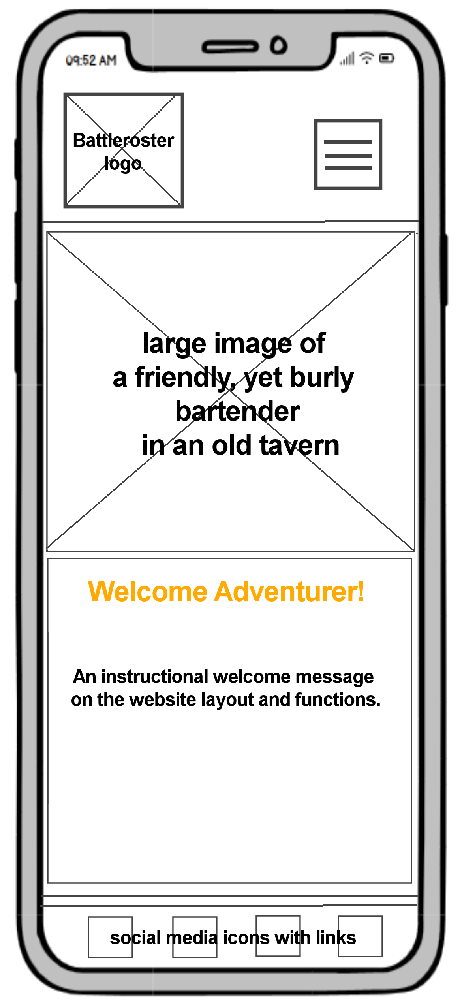
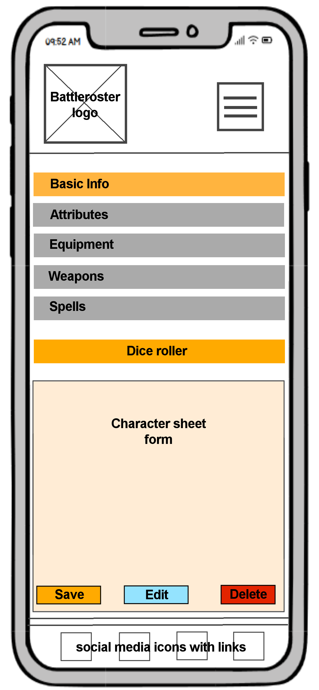
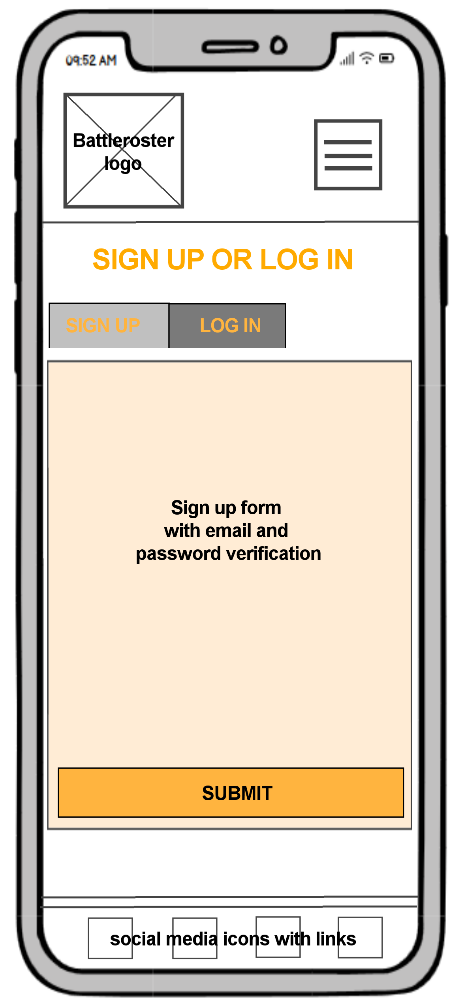
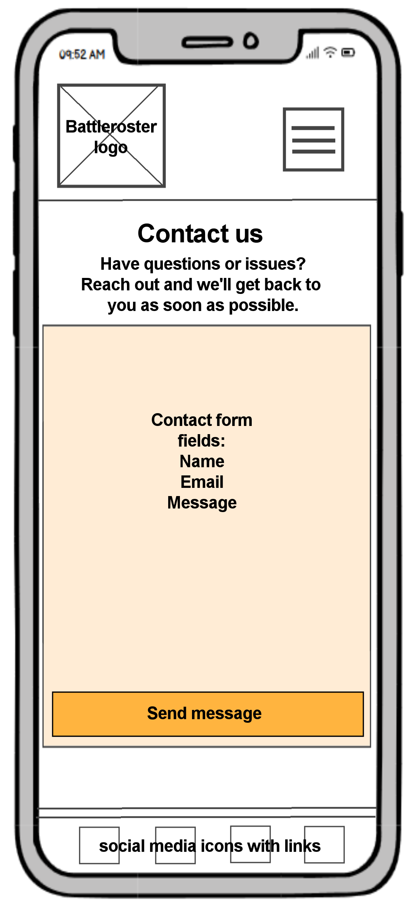

# BattleRoster

**Author:** Tyler Worth


- GitHub: [@CutbackTG](https://github.com/CutbackTG)
- Project Link: [https://github.com/CutbackTG/BattleRoster](https://github.com/CutbackTG/BattleRoster)
- Deployment URL: https://battlerosterhost-e22dbecc83dc.herokuapp.com/

## Project Overview

BattleRoster was designed as part of Code Institute’s Level 5 Web Application Development Diploma (Project 3: Full Stack Frameworks with Django). 

The purpose of the project was to produce a data-driven web application using Django for user authentication, CRUD functionality, and responsive front-end design. 

BattleRoster accomplishes this by providing a system for managing role-playing games, enabling players and dungeon masters to create and manage characters, parties and campaigns. 

BattleRoster is a web application built on Django to simplify how players and dungeon masters manage tabletop games. Players can create, edit and manage their character sheets, while dungeon masters can view groups, manage player sheets and coordinate their campaigns.

Designed with extensibility in mind, the system supports modular character sheet templates and can be used across multiple game systems, including Dungeons & Dragons and BattleTech. The site features usability emphasis through responsive design and lightweight interactivity, while user authentication and role-based permissions protect player data.

---

## Features

### User Roles & Authentication
- **Player Account:** Create, edit, and delete character sheets; invite others to groups
- **Dungeon Master Account:** Manage sheets for all members of their group; send invites to the group
- **Authentication:** Extending the Django User model with member roles (Player, DM) and permission policies

### Character Sheet CRUD
- Create, Read, Update, and Delete for Character sheets
- Fields include Name, Race, Class, Stats, Equipment, etc.
- Individual field values saved dynamically
- Ability for player accounts to have multiple characters

### Parties
- A party consists of a single Dungeon Master and: multiple players
- Able to sign up via email or username
- **Permissions:** Players can only manage their own sheets, while DMs manage all sheets within their group

### Extensibility for Game Systems
- Character sheet templates will be modular for different game systems
- Currently supports D&D 5e with future support for BattleTech and others
- New game systems can be added with relative ease

### Future Work
- Implement WebSocket-based **live party chat** for campaigns.
- Dice rolling tools
- Campaign notes and logs
- Exporting sheets (PDF, JSON)
- Party Chat feature
- White label version for different game systems (e.g. Pathfinder, Cyberpunk, BattleTech).

---

## Tech Stack

### **Backend**
- **Python 3.12+** – Core programming language  
- **Django 5.2.7** – Web framework for routing, models, templates, and ORM  
- **SQLite** – Default development database

### **Frontend**
- **HTML5** and **CSS3** – Base template structure and styling  
- **Bootstrap 5** – Responsive and consistent UI framework  
- **JavaScript (Vanilla JS)** – Client-side interactivity  
- **Django Template Language (DTL)** – Server-side rendering for dynamic content

### **Authentication & Authorization**
- **Django’s built-in auth system** – Handles user accounts, sessions, and permissions  
- **Custom roles:**
  - *Player* – Owns Characters  
  - *Dungeon Master* – Manages Parties

### **Core Features**
- Character management (CRUD using Django models and forms)  
- Party management (Many-to-Many relationships between Characters and Parties)  
- Local character sheets stored in the database  
- Role-based relationships between Players, Characters, and DMs  

### **Development & Tooling**
- **Virtual Environment (`venv`)** – Isolated development environment  
- **pip** – Python package management  
- **Git & GitHub** – Version control and collaboration  
- **dotenv / python-decouple** – Secure environment variable management  
- **pytest / Django TestCase** – Automated testing framework

### **Deployment**
- **Gunicorn / Daphne (optional)** – WSGI/ASGI servers for production  
- **Heroku / Render / Railway / PythonAnywhere** – Supported hosting options  
- **Whitenoise** – Static file management for production

---

## User Stories

### 1. New User — Quick Character Creator
As a **new visitor**,  
I want to **create a single character sheet without signing up**,  
so that I can quickly test the tool or make a one-off character for a session.

### 2. New User — Player Building Multiple Characters
As a **new registered player**,  
I want to **sign up and create multiple characters**,  
so that I can prepare for different campaigns and track their progress in one place.

### 3. Dungeon Master — Managing Parties and Campaigns
As a **Dungeon Master**,  
I want to **create and manage parties of players**,  
so that I can keep an eye on each player’s character sheets and view their stats during gameplay.

### 4. Experienced D&D Player — Multi-Party Management
As an **experienced player**,  
I want to **build several characters and assign them to different parties**,  
so that I can easily switch between campaigns and coordinate with different groups of friends.

### 5. Returning User — Accessing Saved Characters
As a **returning user**,  
I want to **log back into my account and access all my previously saved characters and parties**,  
so that I can pick up where I left off without recreating my data.

### Table of expectations

| **Persona** | **Description** | **Primary Goals** | **Key Actions in BattleRoster** |
|--------------|-----------------|-------------------|----------------------------------|
| **Guest User** | A first-time visitor who doesn’t want to sign up yet but wants to try out the tool. | Quickly create a one-off character sheet for a session or test the system. | - Use the quick character creator<br>- Export or save locally if available |
| **New Player** | A beginner who registers to manage multiple characters. | Build and store multiple character sheets for different games. | - Sign up<br>- Create and edit characters<br>- View saved characters |
| **Dungeon Master (DM)** | A game organizer who runs campaigns and manages parties. | Oversee multiple parties and monitor players’ character stats during gameplay. | - Create and manage parties<br>- Add or view player characters<br>- Track stats during sessions |
| **Experienced Player** | A long-time D&D player involved in several parties or campaigns. | Manage a roster of characters for multiple groups and easily switch between them. | - Create multiple characters<br>- Assign characters to different parties<br>- Manage party compositions |
| **Returning User** | A previous user returning to continue gameplay. | Retrieve and update saved data without starting over. | - Log in<br>- View and edit saved characters<br>- Rejoin or create new parties |

---

## UI & UX Design

The UX design process followed the five planes of user experience design to ensure BattleRoster was both functional and engaging.

### Strategy Plane
**Goal:** Define the target users and their needs, and align them with the project’s objectives.  

- **Target Audience:** Tabletop gamers and dungeon masters seeking a digital tool to manage campaigns.  
- **User Needs:** Quick and intuitive character creation, persistent data storage, and a simple UI.  
- **Business Goal:** Build a scalable Django-based platform demonstrating authentication, CRUD functionality, and responsive design.

### Scope Plane
**Goal:** Determine which features will be included in the project based on user importance.  

- **Must-have Features:** Character CRUD, user authentication (login/logout), DM party management.  
- **Should-have Features:** Dice roller, contact form.  
- **Could-have Features:** Real-time chat, session logs, and campaign notes.

### Structure Plane
**Goal:** Organize and structure the content and navigation flow.  

- Content and navigation structured around user roles (**Player** vs **Dungeon Master**).  
- Logical flow between character creation, editing, and party management pages.  
- Simple and predictable navigation hierarchy for clarity.

### Skeleton Plane
**Goal:** Create a visual layout for elements on each page.  

- Low-fidelity **wireframes** drawn using pencil concept sketches.  
- Focused on clean, mobile-first layouts for clarity and ease of use.  
- Consistent placement of navigation, buttons, and content areas across pages.  

### Surface Plane
**Goal:** Define the final look and feel of the interface.  

- **Theme:** Fantasy-inspired UI with parchment textures and gold accents.  
- **Typography:** Classic sans-serif fonts combined with strong headers for readability.  
- **Colour Palette:** Gold, black, and warm browns to evoke a “treasure chest” aesthetic.  
- **Visual Goal:** Make the interface feel immersive and consistent with tabletop gaming culture.


## Battleroster Entity Relationship Diagram


The Entity Relationship Diagram (ERD) serves as a representation of the overall database schema for the BattleRoster project and the relationship between Users, Characters, and Parties.

In summary, there exist two types of Users based on Django's built-in user model.  One type of User is a Player and the other a Dungeon Master (DM).

User (Player) records represent common players that are able to create and manage multiple Characters. Each Character will contain properties such as name, level, race, class type, health, mana, and equipment. Each Character will also contain a Foreign Key (player_id) which associates it with the User (Player) owner.

A User (Dungeon Master) record represents a user responsible for one or more game sessions and for the Parties. Each Party will have a unique ID and a Foreign Key (dungeon_master_id) which refers to the Player (User) that created the Party. Each Party is set up with a Many-To-Many relationship to multiple Characters (members). This will allow one DM to run multiple parties and those parties to have multiple Player characters.

Users and Characters have additional local versions, User (local) and Character (local), for use as offline, or stand-alone, character sheets without the requirement of an account as an online registered user. The local entities will retain the same structure as those created by the online registered user, however linking only to the owner instead of an authenticated user, via owner_id Foreign Key.

## Accessibility Considerations

BattleRoster was designed with accessibility and inclusivity in mind:
- Uses semantic HTML5 elements for structure and navigation.  
- Colour contrast tested with WCAG 2.1 AA standards.  
- All interactive elements include ARIA labels and keyboard navigation support.  
- Forms provide clear error messages and input focus states.  
- Fully responsive layout for desktop, tablet, and mobile.

### Wireframes

<table>
  <tr>
    <td align="center">
      <strong>Homepage</strong><br>
      
    </td>
    <td align="center">
      <strong>Characters</strong><br>
      
    </td>
  </tr>
  <tr>
    <td align="center">
      <strong>Signup / Login</strong><br>
      
    </td>
    <td align="center">
      <strong>Contact</strong><br>
      
    </td>
  </tr>
</table>

### Colour Scheme

A simple, bold and striking colour scheme was chosen, gold accents and warm browns add to the effect of gold on wood and chests of gold, a goal for many role-players and one that fits with the Dungeons & Dragons game.


I tested this scheme on Huemint to see its overall appearance and experiment with alternatives, it was here that I decided to add some browns here and there throughout to break through the colder, more warning colours of the plain black and yellow.


## Url to View Map

| **URL Pattern**                      | **View Function**        | **Name**                 | **Purpose / Description**                                                                           |
| ------------------------------------ | ------------------------ | ------------------------ | --------------------------------------------------------------------------------------------------- |
| `/characters/`                       | `characters_view`        | `characters`             | Main character list and creation page. Displays all characters for a player or all players (if DM). |
| `/characters/<int:pk>/`              | `characters_view`        | `character_edit`         | Edit an existing character’s sheet.                                                                 |
| `/characters/delete/<int:pk>/`       | `character_delete`       | `character_delete`       | Delete a character (player or DM permissions).                                                      |
| `/characters/party/`                 | `party_view`             | `party`                  | Displays either the DM party dashboard or the player’s current party view.                          |
| `/characters/party/<int:pk>/`        | `party_detail`           | `party_detail`           | Shows detailed info about a specific party, including all member characters.                        |
| `/characters/party/<int:pk>/remove/` | `party_remove_member`    | `party_remove_member`    | Remove a member from a party (DM or authorized member).                                             |
| `/characters/party/<int:pk>/invite/` | `party_invite`           | `party_invite`           | Invite another user to join a party.                                                                |
| `/characters/party/<int:pk>/select/` | `party_select_character` | `party_select_character` | Players select which of their characters to use in the current party.                               |
| `/characters/dm/parties/`            | `dm_party_list`          | `dm_party_list`          | Dungeon Master dashboard — view, create, or delete managed parties.                                 |

---

## Defensive Design & Security

BattleRoster was developed with a strong focus on data protection, secure authentication, and defensive coding practices to safeguard users and their data.

### Authentication & Access Control
- Used Django's `@login_required` decorator to limit access to logged-in users.  
- Introduced **object-level permission checks** to ensure that users would be able to only read, write, or delete their own data.  
- Employed a **role-based authorization model** for both Players and Dungeon Masters, enabling or disabling access to party and character management functionality accordingly.

### Data and Form Protection
- All forms include **CSRF tokens** in order to prevent the [Cross-Site Request Forgery] attack.  
- **Server-side validation** ensures the user input is appropriately cleaned and validated before being stored in the database.  
- All sensitive operations (such as deleting characters or changing parties) require pop-up confirmation dialogs in order to prevent unintended actions.

### Environment and Configuration Security
- A `.env` file to store sensitive credentials (such as `SECRET_KEY`, email configuration, and database URLS).  
- All environment variables are loaded securely with `python-decouple` to ensure the credentials are not revealed via version control.  
- `DEBUG=False` is always enforced in production in order to avoid disclosing system information.

### Production Hardening
- Use of HTTPS in production deployments ensures security in communication between the server and client.  
- **Whitenoise** serves static files securely and handles appropriate caching headers.  
- Regularly updating dependencies and minimal usage of external packages reduce risk exposture.

BattleRoster employs **OWASP best practices** and takes advantage of the built-in security provisions available in Django to provide a stable, reliable and secure application environment.

---

## BattleRoster Test Documentation

### Lighthouse Scores & W3C Validation checks

Performance & Accessibility

Lighthouse tests report an overall score of 92-100 for each page. 

Accessibility checks have confirmed:
 
Semantic HTML structure used.
ARIA labels where appropriate. 
Colour contrast confirmed to pass WCAG 2.1 AA. 
The application works well on desktop and mobile with lazy loading static assets and compressed CSS.

Homepage index.html


characters.html


signup_login.html


contact.html


### Summary of Automated Testing

| Test Category | Tool Used | Result |
|----------------|-----------|--------|
| HTML Validation | W3C Validator | Passed (minor warnings resolved) |
| CSS Validation | W3C CSS Validator | Passed |
| Accessibility | Lighthouse | 100% score |
| Performance | Lighthouse | 92–100% depending on page |
| Django Unit Tests | `pytest` / `TestCase` | All tests passed successfully |

### Test Runs

| Issue / Feature | Test | Result / Fix |
|------------------|-------|---------------|
| User Registration & Login | Register new users (Player & DM) via `/register/`, log in and out, test session persistence. | Works as expected. If login fails, verify `AUTH_USER_MODEL` and session middleware in `settings.py`. |
| Character Creation | Add a new Character from Player account — ensure all attributes (name, level, race, stats, etc.) save correctly. | Data saves correctly. If failure occurs, check model `Character` and form validation fields. |
| Character Ownership | Verify each Character links to its Player (`ForeignKey` relationship). Ensure Player can only view their own characters. | Access not restricted — add view filtering: `Character.objects.filter(player=request.user)`. |
| Party Creation | Create Party as Dungeon Master; confirm Party is linked to correct DM and visible in DM’s dashboard. | Works. If Party not linking, confirm `dungeon_master` field in `Party` form uses `request.user`. |
| Party Membership | Add multiple Characters to a Party (ManyToMany). Ensure changes reflect for all members. | Characters not updating in reverse relation — ensure `related_name='members'` or call `.save_m2m()`. |
| CharacterLocal Save | Create and update local characters. Test ownership restriction (only owner can modify/delete). | Works. If unauthorized edits occur, add object-level permission check. |
| Data Persistence | Restart app and confirm characters, parties, and users persist (SQLite DB check). | Works. If lost data, verify DB path and migrations (`python manage.py migrate`). |
| Dice Roller (if used) | Simulate dice rolls (e.g., `/roll/1d20/`) and confirm correct random generation. | Values not random — check randomization function or seed reset. |
| UI Rendering | Load templates for dashboard, character sheets, and party list; verify all pages render without error. | Templates render. Fix missing static files with `python manage.py collectstatic`. |
| Error Handling | Submit invalid form data (e.g., missing name, negative level) and confirm validation errors appear. | Validation messages display correctly. |
| Security | Try accessing another user’s character or party via URL ID. Should return 403 or redirect. | Data leak risk — add user ownership checks in views. |
| Deployment Check | Run on production environment (Heroku or similar). Verify DB connections and media/static paths. | Static files not loading — update `STATIC_ROOT` and add `whitenoise`. |

### Automated Test Cases (Django / Pytest)

| Area | Test | Expected Result |
|-------|-------|----------------|
| Models: Character | Create a `Character` object and verify default stats (e.g. level=1, health=100). | Character created successfully with expected default values. |
| Models: Party | Add multiple Characters to a Party (ManyToMany). | All related Characters appear in `party.members.all()`. |
| Models: CharacterLocal | Create and update local character, ensure ownership is correctly linked. | Object saves and retrieves correctly under `owner`. |
| Views: Character List | Access character list endpoint while logged in as Player. | Only that Player’s Characters are returned in the response context. |
| Views: Party Detail | Access Party detail as the Dungeon Master. | Page loads with correct members; unauthorized users receive 403. |
| Forms: CharacterForm | Submit form with valid and invalid data. | Valid data saves successfully; invalid data raises `form.errors`. |
| Auth: Registration | POST to `/register/` with new credentials. | User created; redirected to dashboard or login page. |
| Auth: Login / Logout | Login with valid credentials; logout; access restricted pages. | Authenticated views accessible when logged in; denied after logout. |
| Permissions | Try editing another Player’s Character via direct URL. | Forbidden (403) response or redirect to home. |
| Templates | Render core templates (character list, party view, dashboard). | All templates render without errors using `TemplateResponse`. |
| Dice Roller Utility | Call dice roll function (e.g., `roll_dice('1d20')`). | Returns random integer within correct range; never outside dice bounds. |
| Database Integrity | Run migrations and ensure models create properly. | No migration or schema errors on `python manage.py makemigrations` and `migrate`. |

---

## Reflection & Learning Outcomes

This project greatly improved my understanding of the Model-View-Template architecture and the authentication framework of Django.  
I learned how to develop secure, scalable systems that support multiple user roles and permissions, implement server-side validation, and develop dynamic CRUD functionalities.

A primary challenge was managing user ownership of related objects, ensuring that characters and parties were only accessible by their rightful owners.  
Ultimately, this involved a deeper understanding of Django’s QuerySets, decorators, and context management.  

Deployment was another challenge, particularly related to static asset handling and environment configuration on Heroku.  
Through repeated testing, I learned to configure **Whitenoise**, manage `.env` variables securely, and ensure reliable builds in production.  

Overall, this project solidified my full stack development workflow, from concept, wireframing, database design, testing, and deployment.  
Future development will focus on real-time communication using WebSockets, campaign chat functionality, and **exportable character sheets** would build upon the improvements I made to in-game collaboration.   

---

## Installation & Deployment

### Prerequisites

Before you begin, ensure you have the following installed:

- Python 3.12 or higher  
- pip (Python package manager)  
- Git  
- A code editor (VS Code, PyCharm, etc.)

## Installation & Setup

### 1.Clone the Repository

```bash
git clone https://github.com/CutbackTG/BattleRoster.git
cd BattleRoster
```
### 2.Create a virtual environment

Windows:
``` bash
python -m venv .venv
.venv\Scripts\activate
```
Mac/Linux:
``` bash
python3 -m venv .venv
source .venv/bin/activate
```
### 3.Install Dependencies
``` bash
pip install -r requirements.txt
```
If requirements.txt doesn't exist yet, install Django manually:
``` bash
pip install django==5.2.7
pip freeze > requirements.txt
```
### Environment Variables
Create a .env file in the project root:

SECRET_KEY=your-secret-key-here
DEBUG=True
ALLOWED_HOSTS=localhost,127.0.0.1

### Database configuration (for production)
DATABASE_URL=your-database-url

### Database Setup
Run the following commands to prepare your database:
``` bash
python manage.py makemigrations
python manage.py migrate
```
### Create a Superuser
``` bash
python manage.py createsuperuser
```
### Run the Development Server
``` bash
python manage.py runserver
```
Visit: http://127.0.0.1:8000/

### Access the Admin Panel

Visit: http://127.0.0.1:8000/admin/
Login with your superuser credentials.

### Project Structure


### Testing
Run the full test suite:
``` bash
python manage.py test
```
Run tests for a specific app:
``` bash
python manage.py test accounts
python manage.py test game_characters
```
### Deployment

BattleRoster is a Django application and requires a Python-capable hosting platform.
GitHub Pages will NOT work, as it only hosts static files.

Recommended Deployment Platforms:
Heroku
PythonAnywhere
Render
Railway

### Pre-Deployment Checklist

 Set DEBUG=False in production
 Configure ALLOWED_HOSTS
 Set up a production database (PostgreSQL recommended)
 Configure static file serving (collectstatic)
 Set up environment variables securely
 Enable HTTPS/SSL
 Use a strong SECRET_KEY

 ### Contributing

 Contributions are welcome, please follow the following steps to help develop BattleRoster.

### Fork the repository

Clone your fork:
``` bash
git clone https://github.com/YOUR-USERNAME/BattleRoster.git
```

### Create a feature branch:
``` bash
git checkout -b feature/your-feature-name
```
### Make your changes and commit:
``` bash
git add .
git commit -m "Add: description of your feature"
```
### Push to your fork:
``` bash
git push origin feature/your-feature-name
```
Submit a Pull Request with a clear description of your changes

### Contribution Guidelines

Follow PEP 8 style guide for Python code
Write clear commit messages
Add tests for new features
Update documentation as needed
Keep pull requests focused on a single feature/fix

---

### Credits & Acknowledgements

Code Institute - Project Template and Assessment Criteria 

Bootstrap 5 - UI components 

Font Awesome - icons 

D&D Beyond - inspiration for UI layout and terminology 